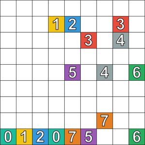

# numberlinkSolver

Ce projet a pour but de résoudre le jeu NumberLink grâce à la formulation en problème SAT et explore des variantes du jeu tels que des formes hexagonales ou des ponts.



## Instructions

Ce projet nécessite principalement l'installation gophersat pour la résolution de problèmes SAT dont le lien est disponible [ici](https://github.com/crillab/gophersat).

Pour installer les librairies nécessaires à l'utilisation du projet:
```sh
pip install -r requirements.txt
```

### Cell Resolution

Pour lancer une résolution via cette méthode, se placer dans le dossier cellResolution puis éxécuter le fichier numberlinkMain :
```
cd cellResolution
python numberlinkMain.py
```

Si `created_with_grid` vaut `True`, une fenêtre s'ouvre pour sélectionner les pairs qui constituent les bouts des chemins. Pour changer les paramètres, changer la taille dans `size`, et `hexa_grid` à `True` (resp. `False`) pour avoir une grille hexagonale (resp. rectangulaire).

Si `created_with_grid` vaut `False`, la grille considérée est celle dans la variable `game`. Dans le fichier `game_storage.py`, il y a plusieurs grilles pour les différents scénarios possibles. Il est possible d'en rajouter en respectant le formatage suivant : un dictionnaire avec :
- `game` (obligatoire) : la grille sous forme de liste de string. Pour des cases inaccessibles, mettre des `"#"`. 
- `bridges` (optionel, `[]` par défaut) : positions des ponts sous forme de liste de coordonées.
- `hexa` (optionel, `False` par défaut) : booléen qui indique si la grille est hexagonale.
- `shiftFirstLine` (optionel, `False` par défaut) : booléen qui indique si les lignes d'indices paires (dont la première) doivent un peu décalés en arrière par rapport aux lignes d'indices impaires.

### Path Resolution

Pour résoudre le jeu avec la méthodes des chemins il suffit de se placer dans le dossier `pathResolution` et suivre ces instructions:
- Compléter le fichier `config.json` avec les paramètres désirés comme `grid_size` pour la taille latérale de la grille (ou taille de la ligne la plus grande pour un hexagone) et la `shape` désirée (`rectangle` ou `hexagon`). `extremities` peut être complété manuellement comme dans les commentaires de `solver.py` ou simplement laissé vide puis sera complété automatiquement par la suite.
- Lancer le script `solver.py` et dans l'UI qui apparaît cliquer sur les extrémités désirées. `config.json` sera mis à jour pour réutilisation future.
- Lancer `plot.py` pour afficher la solution.
- Enjoy !
